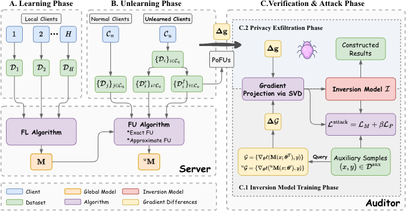

# Verifiably Forgotten? Gradient Differences Still Enable Data Reconstruction in Federated Unlearning

The repositorie is the code of "Verifiably Forgotten? Gradient Differences Still Enable Data Reconstruction in Federated Unlearning".

<p align="center">
  
</p>

---
##  Create and activate environment
```python
conda create -n igf python=3.10
conda activate igf
```

##  Install the required repository

```python
pip install -r requirements.txt
cd IGF
```
---

##  Datasets
- CIFAR10
- CIFAR100
- MNIST
- FashionMNIST

---

## Generate Federate Model

```python
python training.py --model lenet --dataset CIFAR10 --type sample --unlearning retrain --aggregation fedavg
```

```python
option:
--dataset CIFAR10, CIFAR100, MNIST, FashionMNIST
--model lenet, lenetmnist, resnet20, mnist_resnet20
--type sample, class, client
--unlearning retrain, efficient
--aggregation fedavg, fedprox, fedopt
```
---
## Quick Start

```python
python main.py --lr 1e-4 --epochs 30 --leak_mode none --dataset CIFAR10 --batch_size 256 --shared_model LeNet --type sample --unlearning retrain --state attack
```

## Citation

If you find this work useful, please consider citing our paper:

```bibtex
@misc{zhang2025verifiablyforgottengradientdifferences,
      title={Verifiably Forgotten? Gradient Differences Still Enable Data Reconstruction in Federated Unlearning}, 
      author={Fuyao Zhang and Wenjie Li and Yurong Hao and Xinyu Yan and Yang Cao and Wei Yang Bryan Lim},
      year={2025},
      eprint={2505.11097},
      archivePrefix={arXiv},
      primaryClass={cs.CR},
      url={https://arxiv.org/abs/2505.11097}, 
}
```
